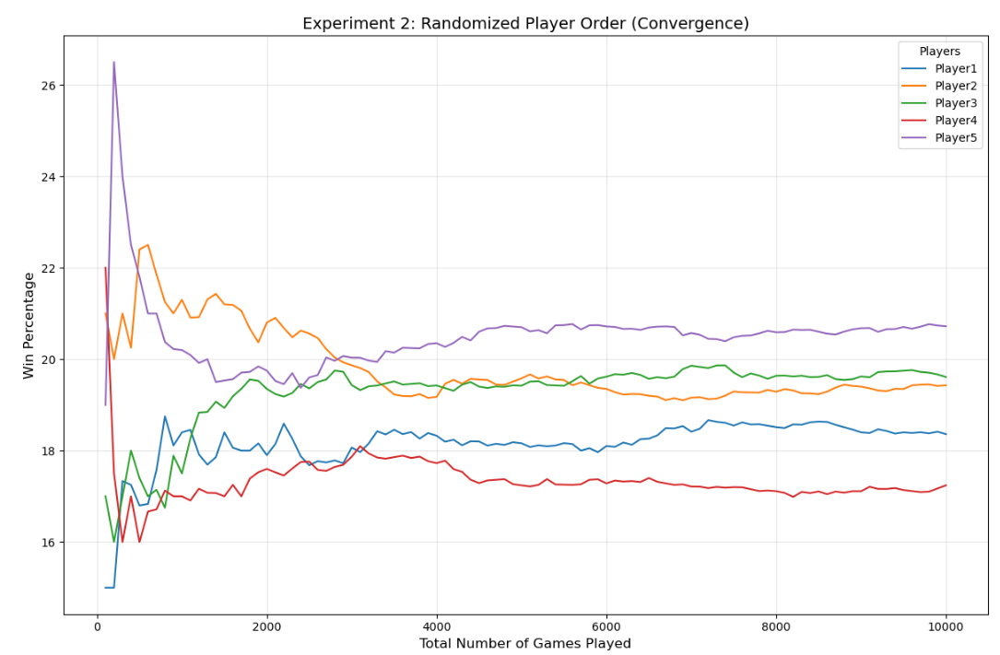
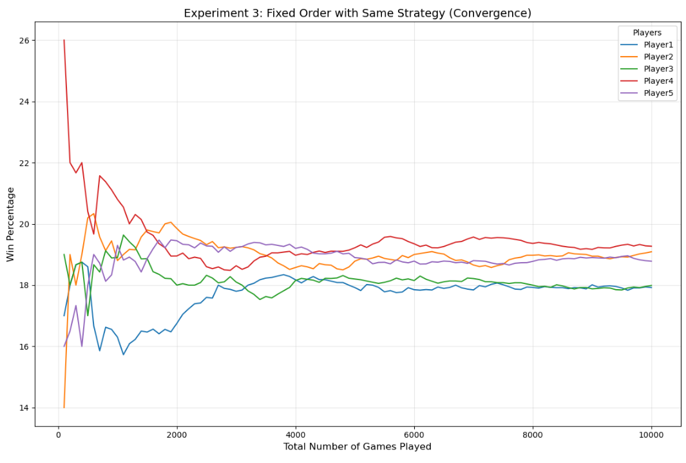

# 2024Fall_projects

<h1>Love Letter: A Monte Carlo Simulation</h1>

Becca Cohen, Sarah Griebel, Andrew Nam
IS597 - Fall 2024

Monte Carlo Simulation for the card game Love Letters: To run the game simulation, access game_sim.py and run this file.

<h2>Game Overview</h2>

<h3>Premise:</h3> The premise of the game love letters is to be the last remaining player in the game, allowing you to deliver your letter to the princess over other suitors! In the case that the deck runs out before there is one remaining player, the player with the highest value card is the winner.

<h3>Simulation Design: What we randomized</h3>

Shuffling the deck
Drawing the card
Dealing card in the beginning of the game
Choosing target for card effects
Guess when playing the Guard card (strategy 2, 3, & 5)

<h3>Strategy Overview</h3> 
Each of these strategies take place when the player draws a guard, and is based on how they decide what card to guess.

<h4>Strategy 1: Guard-Princess</h4>
The player will always guess Princess.

<h4>Strategy 2: Guard-Max</h4>
The player will randomly guess one of the cards that has the greatest count of those in play. That is, if there are two Prince cards and two Baron cards still in play, Strategy 2 will guess one of these randomly.

<h4>Strategy 3: Guard-Random-Remaining</h4>
The player will guess a random card from the cards still in play, regardless of the count of each card in play.

<h4>Strategy 4: Guard-Random-WholeDeck</h4>
The player will guess a random card from the entire deck.

<h4>Strategy 5: Guard-Max-Max (New! This strategy was added in post-analysis)</h4>
Of the cards with the maximum count that are still in play, the player will guess the card that has the higher value.

<h3>Our Hypotheses</h3>

Hypothesis 1: Strategy one performs the worst since there is only one Princess card in the deck, and thus it is likely this guess will be incorrect and thus a bad strategy for guessing, resulting in less wins.
Hypothesis 2: Strategy 2 will beat randomly choosing from all cards in play (Strategy 3). This is because this strategy utilizes the frequency of cards left in the deck, which we expect should lead to more correct guesses and thus wins.
Hypothesis 3: Randomly choosing from all cards in play (Strategy 3) should outperform Strategy 4 which includes the whole deck, and thus cards no longer in play. Therefore, Strategy 4 has the potential to guess a card no longer in play, and is more likely to make an incorrect guess (as compared to Stategy 3 which only considers cards still in play) and have less wins.

<h3>Discussion/Results</h3>

In post-analysis, we updated Strategy 2 to ensure that its card choice was truly a random pick. 
In this update, we also implemented Strategy 5, which we assumed would have a slight performance 
advantage. Indeed, as we thought, Strategy 5 outperforms all other strategies. To make sure this
was not due to an artificial boost it may have received from the player order in the game, we
tested two validation strategies: one in which player order was fixed and one in which it was 
randomized. In both cases, Strategy 5 achieves the top performance:

To balance this validation, we also ensure that win distribution would be equal if all players
were to use the same strategy:

<h3>Future Directions</h3>

Our strategies were all related to the Guard card's guess, but there are many other ways to 
strategize in this game! There is opportunity for future work to be developed around which
players to trade with when using the King card, or which players to target when using the Guard
card. 
